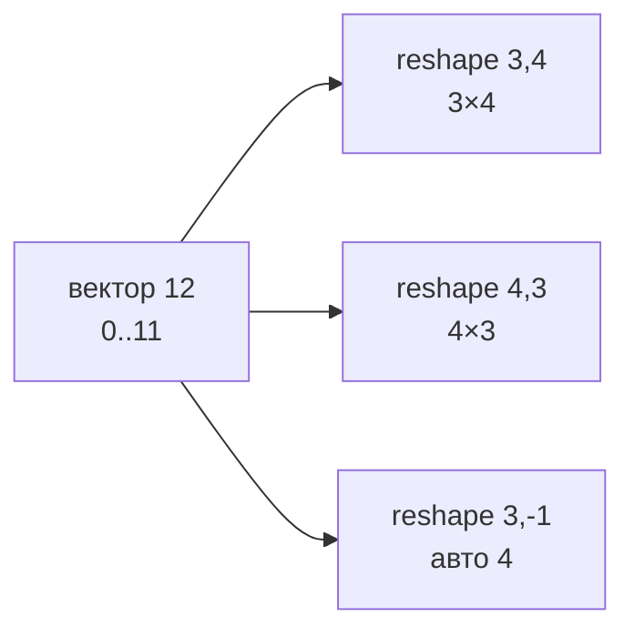
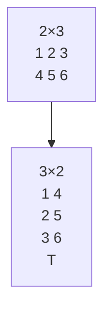
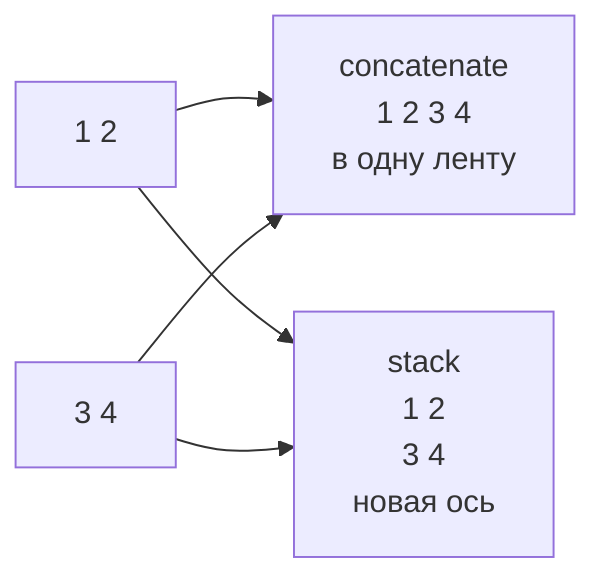

# 07. Управление формой массива: изменение, транспонирование и соединение

> [!abstract] Цель и задачи лекции
> **Цель:** систематизировать операции управления формой `ndarray` без нарушения целостности данных.
> **Задачи:** сопоставить `reshape(-1)`/`ravel`/`flatten`/`T` по признаку «вид vs копия»; описать `concatenate`/`stack`/`vstack`/`hstack`; ввести критерий `shares_memory`.
>
> *Пояснение для начинающих (для чайника):* 12 чисел — это `3×4` или `4×3` или вектор — решаешь ты `reshape`; `T` — повернуть стол, `ravel` в вектор (вид), `flatten` — копия; представь `reshape` как переложить плитки без перекраски.

---

# Изменение формы: `reshape` и `-1`



```python
import numpy as np
a = np.arange(12)  # (12,)
print(a.reshape(3,4))   # 3 строки 4 столб
print(a.reshape(4,3))   # 4 строки 3 столб
print(a.reshape(3,-1).shape, a.reshape(-1,3).shape)  # (3,4) (4,3) — -1 считает сам
```

`-1` — «посчитай сам»: `12` и `3` → `4`. Один `-1` на вызов.

| Для чайника | Что | Копия? |
|---|---|---|
| `reshape(3,4)` | новый вид | **вид** если подряд |
| `ravel()` | в вектор | вид если можно |
| `flatten()` | в вектор | **копия всегда** |
| `T` | поворот | вид |
| `[:,None]` | добавить ось | вид |

`np.shares_memory(a, a.reshape(3,4))` → `True` — одни данные. После `T` `reshape` может тихо скопировать — проверяй `shares_memory` где важно.

---

# Транспонирование и перестановка осей

```python
m = np.array([[1,2,3],[4,5,6]])  # (2,3)
print(m.T)  # (3,2) [[1 4][2 5][3 6]] — строки↔столбцы
print(m[0,1], m.T[1,0])  # 2 2 — одно число две бирки
```



Для 3D `np.arange(24).reshape(2,3,4).transpose(1,0,2)` → `(3,2,4)` — переставил оси 0 и 1.

---

# Соединение массивов



```python
a=np.array([1,2]); b=np.array([3,4])
print(np.concatenate([a,b]))  # [1 2 3 4]
print(np.stack([a,b]))        # [[1 2][3 4]] — новая ось 0
print(np.vstack([a,b]))       # [[1 2][3 4]]
print(np.hstack([a,b]))       # [1 2 3 4]
```

| Для чайника | Требует | Результат |
|---|---|---|
| `concatenate axis0` | всё кроме `axis` совпадает | склейка |
| `stack` | `shape` равны | новая ось |
| `vstack/hstack` | — | вертикально/горизонтав |

Диагностика `ValueError: dimensions except for concatenation axis` (пояснение для начинающих): кроме оси склейки размеры не совпали.

---

# Семантика операций: на месте vs новый массив

```python
a = np.array([1.,2.,3.])
b = a+1    # новый массив
a +=10     # на месте, без нового блока
print(a,b)  # [11.12.13.] [2. 3. 4.]

c=np.array([1,2,3]); d=c.reshape(3,1)  # вид!
d[0,0]=99; print(c, np.shares_memory(c,d))  # [99 2 3] True — поменял через вид!
```

`+=` — на месте, `+` — новый. `reshape/T` — вид → правишь вид — правишь оригинал. Хочешь независимо — `flatten()` или `.copy()`.

---

# Параметр `keepdims`: сохранение размерности

```python
table = np.array([[5,4,5],[3,4,3],[4,5,5]], dtype=float)
means = table.mean(axis=0, keepdims=True)  # (1,3) [[4. 4.33 4.33]]
print(means.shape)
print(np.round(table - means,2).tolist())  # [[1. -0.33 0.67] ...] — (3,3)-(1,3) ок
```

Без `keepdims` `(3,)` vs `(1,3)` — по-разному склеится с `concatenate`. Подробнее [[05. Агрегирующие функции и параметр оси (axis). Управление размерностью]].

---

# Рекомендации по применению в проектах

1. `reshape(-1)` вектор без длины.
2. `ravel` вид, `flatten` копия для правки.
3. `assert not shares_memory(a, b.reshape(...))` если трогать нельзя.
4. `assert a.shape[1]==b.shape[1]` перед `vstack`.
5. `keepdims` для `table-means` явно.

---

# Типичные заблуждения

| Думают | На самом деле |
|---|---|
| `reshape` копия | Часто вид |
| `ravel=flatten` | `ravel` вид, `flatten` копия |
| `T` копия | Вид |
| Всё склеится | Кроме `axis` должны совпасть |
| `keepdims` не нужен | `(3,)` vs `(1,3)` по-разному |

---

# Вопросы для самопроверки

1. `reshape(3,-1)` vs `(-1,3)`?
2. Почему часто вид?
3. `ravel` vs `flatten`?
4. `concatenate (2,3)+(3,3) axis0`?
5. Зачем `keepdims`?

> [!success]- Ответы
> 1. 3 строки авто столб vs 3 столб авто строк.
> 2. Меняет `shape` без копирования данных.
> 3. Вид если можно vs копия всегда.
> 4. Ошибка `2≠3`.
> 5. Оставить `1` для broadcast/concatenate.

---

# Практика

[[03. Практика. Форма и скорость]] — `reshape`, `T`, `concatenate`.

---

# Опора на дисциплину 02

- `matrix[0][1]` → `arr[0,1]` + `reshape` без цикла
- `list+list` → `concatenate` с `axis`

---

# Связи

- [[03. Индексация и срезы многомерных массивов. Представления и копии]] — виды
- [NumPy — reshape](https://numpy.org/doc/stable/reference/generated/numpy.reshape.html)

