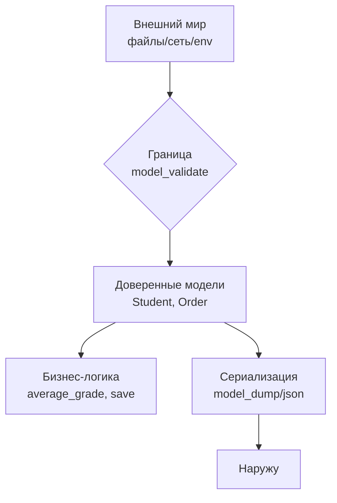
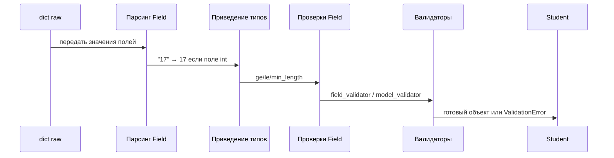

# 01. Введение в валидацию данных. Границы системы и модель BaseModel

> [!abstract] Цель и задачи лекции
> **Цель:** обосновать необходимость валидации данных на границе системы и ввести понятие модели `BaseModel` как контракта.
> **Задачи:** показать проблему ручных проверок `dict` и несогласованных типов; ввести модель `Student` и механизм приведения `str→int`; разобрать структуру `ValidationError` (`type`/`msg`/`loc`).
>
> *Пояснение для начинающих (для чайника):* представь модель как паспортный стол — объявил поля `name: str, age: int` один раз, а Pydantic на границе проверяет каждую анкету и сразу говорит, где ошибка, вместо `if` в десяти функциях.
>
> ```mermaid
> flowchart LR
>   A[данные снаружи<br>JSON/CSV] --> B[модель<br>BaseModel]
>   B --> C{валидация}
>   C -- ok --> D[объект<br>Student]
>   C -- fail --> E[ValidationError<br>loc/msg]
> ```


# Проблема: данные «как получилось»

```python
student = {"name": "Аня", "age": "17", "average": "4.5"}
print(student["age"] + 1)
```

```text
TypeError: can only concatenate str (not "int") to str
```

Классика: в JSON или CSV всё строки, и приведение типов ложится на код. Каждая функция
начинает проверять «а точно ли это число», и в проекте появляются десятки одинаковых
проверок. Пропущенная проверка вылезет в самом неудобном месте — например, при подсчёте
среднего балла класса.

Так выглядел бы код без модели — проверки разбросаны:

```python
def average_grade(raw_students: list[dict]) -> float:
    """Средний балл — но сначала проверяет каждый словарь вручную."""
    total = 0
    for raw in raw_students:
        age = raw.get("age")
        if not isinstance(age, int):
            try:
                age = int(age)
            except (TypeError, ValueError):
                raise ValueError(f"плохой возраст: {age!r}")
        if not 0 < age < 150:
            raise ValueError(f"возраст вне диапазона: {age}")
        # ... и так для каждого поля
        total += raw["average"]  # а это вообще строка?
    return total / len(raw_students)
```

Ошибка в одном месте — и весь расчёт ломается в глубине, где уже непонятно, откуда
пришли данные.

# Модель описывает правильный объект

```python
from pydantic import BaseModel, ValidationError


class Student(BaseModel):
    """Студент: имя, возраст, средний балл."""

    name: str
    age: int
    average: float


raw = {"name": "Аня", "age": "17", "average": "4.5"}
student = Student(**raw)
print(student)
print(student.name, student.age + 1, student.average * 2)
print("типы:", type(student.age).__name__, type(student.average).__name__)
```

```text
name='Аня' age=17 average=4.5
Аня 18 9.0
типы: int float
```

Что произошло:

1. `Student` — **модель**: список полей и их типов;
2. `Student(**raw)` — **валидация**: Pydantic проверил данные и привёл типы — `"17"` стал
   `int`, `"4.5"` — `float`;
3. `student` — **обычный объект Python** с полями, по которым работает автодополнение
   в редакторе и проверка типов `mypy`.

После этого функция расчёта становится чистой — ей не нужно проверять типы:

```python
def average_grade(students: list[Student]) -> float:
    """Считает средний балл по уже проверенным студентам."""
    return sum(s.average for s in students) / len(students)
```

Разница принципиальная: первая версия принимает `dict` и гадает, вторая — принимает
`Student` и доверяет.

# Что происходит при плохих данных

```python
bad = {"name": "Аня", "age": "семнадцать", "average": 4.5}
try:
    Student(**bad)
except ValidationError as exc:
    print("ошибок:", exc.error_count())
    print(exc.errors()[0]["type"], "|", exc.errors()[0]["msg"], "| поле:", exc.errors()[0]["loc"])
```

```text
ошибок: 1
int_parsing | Input should be a valid integer, unable to parse string as an integer | поле: ('age',)
```

Три вещи, которые важно увидеть:

| Что | Значение |
|---|---|
| исключение | `ValidationError` — свой тип, а не `ValueError` или `TypeError` |
| `error_count()` | сколько полей не прошло проверку (Pydantic собирает **все** ошибки, а не первую) |
| `errors()` | список: тип ошибки, сообщение и место (`loc`) — путь до поля |

Это тот самый «понятный отказ», о котором говорилось в инженерном курсе
([[01. Обработка ошибок полностью]]): вместо «что-то пошло не так» — точное место
и причина.

# Как это делают в проекте

В проекте валидация стоит **один раз, на границе** — там, где данные входят извне. Дальше
по коду идут уже готовые модели, и проверять их снова не нужно.

```python
# src/app.py — граница приложения
from pathlib import Path
import json
from pydantic import ValidationError

from models import Student  # модель описана один раз

def load_students(path: Path) -> list[Student]:
    """Читает файл и возвращает проверенных студентов; плохая запись — в лог."""
    raw_list = json.loads(path.read_text(encoding="utf-8"))
    students: list[Student] = []
    for idx, raw in enumerate(raw_list, start=1):
        try:
            students.append(Student.model_validate(raw))
        except ValidationError as exc:
            # на границе — собираем понятный отчёт, а не падаем
            reasons = "; ".join(f"{'.'.join(str(p) for p in e['loc'])}: {e['msg']}" for e in exc.errors())
            print(f"запись {idx} отклонена: {reasons}")
    return students

def average_grade(students: list[Student]) -> float:
    """Внутри программы типы уже проверены — никаких if-ов."""
    return sum(s.average for s in students) / len(students)
```

Что здесь важно:

1. **Одно место описания.** Поля `name`, `age`, `average` описаны в `Student`, а не в десяти функциях. Поменялось правило «возраст от 6 до 100» — меняешь одну модель.
2. **Граница — одна.** `load_students` — единственное место, где ловят `ValidationError`. Внутри `average_grade`, `save_students`, `build_report` никаких `try/except` для данных нет: тип `list[Student]` уже гарантирует правильность.
3. **Отказ — заметный.** Плохая запись не молча пропускается и не роняет всю программу: она попадает в отчёт с номером и причиной. Это правило «ошибка должна быть видна» из [[01. Обработка ошибок полностью]].
4. **Автодополнение и `mypy` работают.** После `student = Student(**raw)` редактор знает, что `student.age` — `int`, и подсветит `student.age + "год"` как ошибку до запуска.

Анти-паттерн, который исчезает:

```python
# плохо: проверка в каждой функции, ошибки — в разных местах
def print_student(raw: dict) -> None:
    if "age" not in raw or not str(raw["age"]).isdigit():
        print("плохой возраст")
        return
    age = int(raw["age"])
    print(f"{raw['name']}, {age} лет")
```

С моделью та же задача — одна строка:

```python
def print_student(student: Student) -> None:
    print(f"{student.name}, {student.age} лет")
```

# Кому особенно нужен Pydantic

- **Настройки приложения** — переменные окружения и `.env` ([[05. Управление конфигурацией. BaseSettings, окружение и секреты]]).
- **Данные из файлов и API** — JSON, YAML, ответы сервисов ([[04. Сериализация моделей. model_dump, JSON и JSON Schema]]).
- **Свои модели предметной области** — студент, операция, заказ ([[06. Модели в архитектуре приложения. Вложенность, TypeAdapter и выбор инструмента]]).
- **Веб-фреймворки** — FastAPI построен на Pydantic: те же модели описывают запросы и ответы.
  Django-разработчику Pydantic тоже полезен: например, для валидации данных вне форм
  и для настроек.

# Установка

```bash
uv add pydantic
uv run python -c "import pydantic; print(pydantic.VERSION)"
```

```text
2.13.5
```

> [!note] Про версии
> Pydantic 2 работает заметно иначе, чем 1.x: другие названия методов (`model_dump`
> вместо `dict`), другой синтаксис валидаторов. Старые примеры из интернета могут
> не запускаться — проверяй версию.

# Подробный разбор: как устроена валидация изнутри

## 1. Где проходит граница — полная карта источников

Не любой `dict` нуждается в проверке. Граница — там, где данные **впервые** входят в доверенную зону:

| Источник | Пример | Почему это граница | Что делать |
|---|---|---|---|
| Файл `JSON/CSV/YAML` | `json.load(open("data.json"))` | формат строк, опечатки, пустые поля | `Model.model_validate_json()` один раз |
| Сеть / API | `requests.get(...).json()` | чужая схема, версионирование | `TypeAdapter[list[Model]]` |
| CLI / аргументы | `argparse`, `sys.argv` | всё — строки | `BaseSettings` / модель CLI |
| Переменные окружения | `os.environ` | строки, отсутствие | `BaseSettings` |
| Ввод пользователя | `input()` | произвольный текст | модель формы |
| БД (чужая) | `cursor.fetchone()` | `None`, типы драйвера | модель строки |

Внутри доверенной зоны — уже `list[Student]`, и повторная проверка лишь дублирует код. Поэтому архитектура проекта обычно выглядит так:



Правило: **один вход — одна проверка**. Если функция получает `Student`, она не ловит `ValidationError` — он уже пойман выше.

## 2. Жизненный цикл одной валидации

Когда вызываешь `Student(**raw)`, Pydantic делает 5 шагов:



Важно: **приведение (coercion) идёт до проверок**. Поэтому `Field(ge=0)` получит уже число `17`, а не строку `"17"`. Если привести нельзя — сразу ошибка `int_parsing` без проверки диапазона.

Таблица приведений, которые Pydantic делает автоматически (режим по умолчанию `strict=False`):

| Объявлено | Пришло | Стало | Примечание |
|---|---|---|---|
| `int` | `"17"`, `17.0`, `True` | `17` | `True` → `1`, `" 17 "` — тоже `17` |
| `float` | `"4.5"`, `4`, | `4.5` | |
| `bool` | `"true"`, `1`, `"yes"` | `True` | для JSON/`BaseModel` |
| `str` | `123` | `"123"` | число → строка |
| `date` | `"2026-09-01"` | `date(2026,9,1)` | ISO 8601 |
| `list[int]` | `("1","2")` | `[1,2]` | кортеж → список |

Хочешь запретить неявность — поставь `Field(strict=True)` или `model_config = ConfigDict(strict=True)`. Тогда `"17"` для `int` даст ошибку. В курсе по умолчанию оставляют мягкий режим, потому что данные с границы часто строковые.

```python
from pydantic import BaseModel, ConfigDict, ValidationError

class StrictStudent(BaseModel):
    model_config = ConfigDict(strict=True)
    age: int

try:
    StrictStudent(age="17")
except ValidationError as exc:
    print(exc.errors()[0]["type"])  # int_type_expected
```

## 3. Анатомия `ValidationError` — поле за полем

```python
from pydantic import BaseModel, Field, ValidationError

class Student(BaseModel):
    name: str = Field(min_length=2)
    age: int = Field(ge=0, le=150)

try:
    Student(name="А", age="bad")
except ValidationError as exc:
    for e in exc.errors():
        print(e)
    print("count=", exc.error_count())
    print(exc.json(indent=2))
```

```text
{'type': 'string_too_short', 'loc': ('name',), 'msg': 'String should have at least 2 characters', 'input': 'А', 'ctx': {'min_length': 2}, 'url': 'https://errors.pydantic.dev/2.13/v/string_too_short'}
{'type': 'int_parsing', 'loc': ('age',), 'msg': 'Input should be a valid integer, unable to parse string as an integer', 'input': 'bad', 'url': 'https://errors.pydantic.dev/2.13/v/int_parsing'}
count= 2
[
  {
    "type": "string_too_short",
    "loc": ["name"],
    "msg": "String should have at least 2 characters",
    "input": "А",
    "ctx": {"min_length": 2}
  }
]
```

| Ключ | Что означает | Как использовать |
|---|---|---|
| `type` | машинный код ошибки (`string_too_short`, `int_parsing`, `missing`) | ветвление `if e["type"] == "missing"` |
| `loc` | путь до поля — кортеж (`"age",`) или (`"operations",0,"amount"`) | `".".join(str(p) for p in loc)` для отчёта |
| `msg` | человеческое сообщение (англ.) | показать после перевода/маппинга |
| `input` | что пришло от пользователя | в лог для отладки |
| `ctx` | контекст (`{"ge":0}`) | подставить в шаблон |
| `url` | ссылка на доку `errors.pydantic.dev` | в debug-вывод |

Pydantic **собирает все ошибки**, а не останавливается на первой. Это позволяет показать пользователю сразу все поля формы, а не гонять по одному.

## 4. Два режима ошибок — «поле отсутствует» vs «поле неверно»

```python
class Student(BaseModel):
    name: str
    age: int | None = None

# 1) поля нет вовсе
try: Student.model_validate({})
except ValidationError as exc: print(exc.errors()[0]["type"])  # missing

# 2) поле есть, но пустое
try: Student(name="", age=None)
except ValidationError as exc: print("пустая строка прошла?", exc)
# "" — это значение, Field(min_length=2) поймает, а без ограничения — пройдёт

# 3) None туда, где нельзя
class Note(BaseModel):
    text: str          # None нельзя
try: Note(text=None)
except ValidationError as exc: print(exc.errors()[0]["type"])  # string_type
```

Различай: `missing` → «забыли передать», `string_too_short` / `int_parsing` → «передали, но не то». В отчёте это разные фразы: «поле age обязательно» vs «age: не число».

## 5. Где валидация не нужна и даже вредна

Валидировать каждую промежуточную переменную — зашумляет код и замедляет (см. лекцию 08 — ~6×). Пример анти-паттерна:

```python
# плохо: внутри цикла гоняют данные через модель без нужды
for row in already_validated:
    s = Student.model_validate(row)  # row — уже Student!
```

Критерий: данные **появились внутри доверенной зоны** (ты их создал) — не валидируй. Данные **пересекли границу** (файл, сеть, ввод) — валидируй ровно один раз.

# Типичные заблуждения

| Заблуждение                                           | Как на самом деле                                                           |
| ----------------------------------------------------- | --------------------------------------------------------------------------- |
| «Проверять вручную надёжнее — видно каждый `if`»      | Ручные проверки дублируются и пропускаются; модель — одно место для правил  |
| «Pydantic только проверяет, а типы остаются строками» | Он и проверяет, и **приводит** (`"17"` → `17`), если тип позволяет          |
| «`ValidationError` — то же, что `ValueError`»         | Это отдельный тип со списком ошибок, каждая с `type`, `msg` и `loc`         |
| «Модель нужна для каждого словаря»                    | Модель — для данных на границе; внутренние структуры могут быть `dataclass` |
|                                                       |                                                                             |

# Проверь себя

1. Зачем нужна модель, если данные можно проверять вручную?
2. Почему Pydantic сразу приводит `"17"` к числу?
3. Что такое `ValidationError` и чем он полезнее `ValueError`?
4. Где в проекте должна стоять проверка данных?
5. Чем Pydantic полезен в проекте на Django?

> [!success]- Ответы
> 1. Описание объекта хранится в одном месте, и все проверки делает библиотека — вручную
>    их легко забыть или продублировать.
> 2. Потому что тип поля объявлен как `int`: Pydantic старается привести данные к нужному
>    типу, а не только проверить их.
> 3. Это отдельное исключение со списком ошибок, каждое из которых содержит тип, сообщение
>    и путь до поля.
> 4. На границе: там, где данные входят в программу (файл, сеть, форма, настройки).
> 5. Для проверки данных, не связанных с формами (импорт, внешние API), и для настроек.

# Практика

[[01. Практика. Описание моделей, типы и пользовательские валидаторы]] — первая задача разбирает эту лекцию на практике: создание `Student` из строк, проверка типов, разбор `ValidationError`.

# Опора на дисциплину 02

Материалы курса Python, на которые опирается лекция, и то, что она к ним добавляет:

- [[05. Язык Python - идентификаторы, операторы, типы данных]] — типы данных (`int`, `str`, `float`) и приведение типов (`int("17")`): там типы проверялись вручную через `isinstance` и `try`.
- [[07. Линейный алгоритм]] — первые задачи с проверкой ввода: на них видно, как без модели каждая функция начинает с `if age < 0`.
- [[14. Функции и модули]] — аннотации параметров (`def average(students: list[Student])`): в дисциплине 02 они были подсказкой, здесь они становятся правилом.

Что добавляет лекция: аннотация перестаёт быть подсказкой и начинает **проверять данные во время работы** — модель как договор на границе.

# Связи с другими темами

- [[02. Модели Pydantic. Поля, типы данных и ограничения Field]] — какие типы можно объявлять и как задавать ограничения.
- [[03. Пользовательские валидаторы. field_validator и model_validator]] — проверки, которых не выразить одним типом.
- [[02. Типизация и аннотации]] — аннотации в Python, на которых строятся модели.
- [[01. Обработка ошибок полностью]] — свои исключения и понятные сообщения.
- [[00. Pydantic]] — программа курса.
