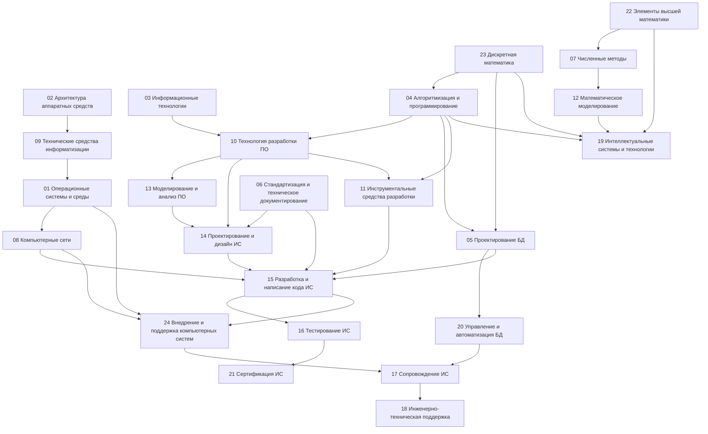

# Генеральный учебный план специалиста по информационным системам

> Рабочая версия 1.0, 07.10.2026.
>
> Это **авторская интегрированная программа**, а не официальный учебный план колледжа.
>
> Базовая опора: ФГОС СПО 09.02.07, примерная образовательная программа 09.02.07 и действующий профессиональный стандарт 06.015 «Специалист по информационным системам». Точный учебный план конкретного колледжа неизвестен; поэтому последовательность ниже строится как инженерно-педагогическая модель и должна уточняться по фактически полученным материалам.

---

# 1. Назначение генерального плана

Генеральный план должен обеспечить три вещи одновременно:

1. покрыть все 24 дисциплины, перечисленные владельцем проекта;
2. связать их в единый граф знаний;
3. встроить современные инструменты — Git, Python, HTML/CSS, Rust и связанные технологии — без превращения программы в набор модных фреймворков.

Главная идея:

```text
Фундамент
  ↓
Алгоритмическое мышление
  ↓
Программирование
  ↓
Данные
  ↓
Системы
  ↓
Анализ и проектирование
  ↓
Разработка
  ↓
Тестирование
  ↓
Внедрение
  ↓
Сопровождение
  ↓
Интеллектуальные и специализированные системы
```

---

# 2. Статусы дисциплин

В план включены все дисциплины из текущего списка владельца.

| № | Дисциплина | Исходное состояние на 06.10.2026 | Роль в общей программе |
|---:|---|---|---|
| 01 | Операционные системы и среды | Пробел со 2 курса | База для процессов, файлов, памяти, служб, командной строки и эксплуатации |
| 02 | Архитектура аппаратных средств | Пробел со 2 курса | Понимание того, на чём выполняется ПО |
| 03 | Информационные технологии | Не преподавалось | Общее поле ИТ, цифровые системы, информация, технологии и инфраструктура |
| 04 | Основы алгоритмизации и программирования | Необходим курс с нуля; текущая ситуация слабая | Центральный фундамент программирования |
| 05 | Основы проектирования баз данных | Был хороший, но ограниченный курс Access | Формирование модели данных и переход к СУБД/SQL |
| 06 | Стандартизация, сертификация и техническое документирование | Не преподавалось | Нормативная и документальная грамотность инженера |
| 07 | Численные методы | Не преподавалось | Алгоритмы для приближённых вычислений и вычислительных задач |
| 08 | Компьютерные сети | Не преподавалось | Сетевой фундамент для ИС и Web |
| 09 | Технические средства информатизации | Был хороший курс | Практическое устройство компьютерных систем |
| 10 | Технология разработки ПО | Изучается сейчас | Процесс разработки, Git, качество, команда, жизненный цикл |
| 11 | Инструментальные средства разработки ПО | Не преподавалось | IDE, toolchain, сборка, отладка, пакеты, CI/CD и инженерные инструменты |
| 12 | Математическое моделирование | Было поверхностно | Связка математики, моделей и вычислений |
| 13 | Моделирование и анализ ПО | Слабое преподавание; C++ ошибочно воспринимался как весь предмет | Модели программных систем, анализ, архитектурное мышление |
| 14 | Проектирование и дизайн информационных систем | Не преподавалось | Системный анализ, архитектура, UX/интерфейсы, модели ИС |
| 15 | Разработка и написание кода ИС | Изучается сейчас | Перевод требований и моделей в рабочую ИС |
| 16 | Тестирование информационных систем | Преподавателя нет | Контроль качества и подтверждение поведения системы |
| 17 | Сопровождение информационных систем | Изучается сейчас | Работа с существующей системой и изменениями |
| 18 | Инженерно-техническая поддержка сопровождения ИС | Изучается сейчас | Диагностика, эксплуатация, инциденты, поддержка |
| 19 | Интеллектуальные системы и технологии | Изучается сейчас | AI/ML и интеллектуальные функции как слой над фундаментом |
| 20 | Управление и автоматизация баз данных | Пробел | Администрирование, резервирование, производительность, автоматизация |
| 21 | Сертификация информационных систем | Пробел | Подтверждение соответствия, требования и процедуры |
| 22 | Элементы высшей математики | Был хороший, но поверхностный курс | Математический фундамент |
| 23 | Дискретная математика | Был хороший, но поверхностный курс | Логика, множества, отношения, графы, комбинаторика |
| 24 | Внедрение и поддержка компьютерных систем | Преподавателя нет | Установка, конфигурация, интеграция, эксплуатация |

---

# 3. Уровни генеральной программы

## Уровень 0. Подготовительный

Результат: учащийся уверенно работает с компьютером, файловой системой, терминалом, редактором и базовой документацией.

Темы:

- файлы и каталоги;
- права и учётные записи на базовом уровне;
- командная строка;
- редактор кода;
- установка программ;
- архивы;
- базовая работа с Git;
- поиск и проверка технической информации.

Дисциплины: 01, 03, 09, 10, 11.

---

# 4. Уровень 1. Компьютер как система

## 4.1. Архитектура аппаратных средств

Изучить:

1. представление информации;
2. системы счисления;
3. кодирование;
4. логические элементы;
5. CPU;
6. регистры;
7. память;
8. шины и интерфейсы;
9. ввод-вывод;
10. хранение данных;
11. GPU и специализированные ускорители на концептуальном уровне;
12. связь аппаратуры с программным обеспечением.

## 4.2. Технические средства информатизации

Изучить:

- внутреннее устройство ПК;
- материнскую плату;
- процессор;
- RAM;
- накопители;
- блок питания;
- охлаждение;
- периферию;
- диагностику аппаратных неисправностей;
- совместимость компонентов.

Связь:

```text
02 Архитектура
      ↓
09 Технические средства
      ↓
01 ОС
      ↓
11 Инструменты разработки
```

---

# 5. Уровень 2. Операционные системы

## 01. Операционные системы и среды

Порядок:

1. зачем нужна ОС;
2. ядро и пользовательское пространство;
3. процессы;
4. потоки;
5. планирование;
6. память;
7. виртуальная память;
8. файловые системы;
9. права доступа;
10. системные службы;
11. процессы ввода-вывода;
12. IPC;
13. командная строка;
14. журналирование;
15. базовая диагностика;
16. Linux/Windows как практические среды;
17. виртуализация как обзор.

Связь:

```text
02 + 09
   ↓
01 ОС
   ↓
08 Сети
   ↓
24 Внедрение
   ↓
18 Поддержка
```

---

# 6. Уровень 3. Математический и дискретный фундамент

## 22. Элементы высшей математики

Последовательность:

- функции;
- графики;
- предел;
- производная;
- исследование функций;
- интеграл;
- ряды на необходимом уровне;
- основы многомерного анализа;
- базовая вероятность и статистика.

## 23. Дискретная математика

Последовательность:

- логика;
- высказывания;
- логические функции;
- множества;
- отношения;
- функции;
- комбинаторика;
- графы;
- деревья;
- рекуррентные зависимости;
- булева алгебра;
- основы доказательств.

Связь:

```text
22 Математика ─────┐
                   ├→ 07 Численные методы
23 Дискретка ──────┤
                   ├→ 04 Алгоритмы
                   ├→ 13 Моделирование
                   └→ 19 Интеллектуальные системы
```

---

# 7. Уровень 4. Информационные технологии

## 03. Информационные технологии

Курс должен связать всё поле ИТ:

1. информация и данные;
2. вычислительная система;
3. информационная система;
4. ПО и аппаратное обеспечение;
5. локальные и глобальные сети;
6. базы данных;
7. облачные сервисы;
8. жизненный цикл информации;
9. информационная безопасность;
10. цифровизация бизнес-процессов;
11. типовые архитектуры ИС;
12. роль ИТ-специалистов.

Это должен быть не «курс офисных программ», а **карта всей профессии**.

---

# 8. Уровень 5. Алгоритмы и программирование

## 04. Основы алгоритмизации и программирования

### Блок A. Алгоритмическое мышление

- алгоритм;
- исполнители;
- состояние;
- последовательность;
- условие;
- цикл;
- функция;
- декомпозиция;
- поиск;
- сортировка;
- рекурсия;
- сложность;
- структуры данных;
- абстракция.

### Блок B. Python

- синтаксис;
- типы;
- коллекции;
- условия;
- циклы;
- функции;
- модули;
- исключения;
- файлы;
- ООП;
- тестирование;
- базовая типизация;
- структура проекта.

### Блок C. Инженерное программирование

- Git;
- окружение;
- зависимости;
- линтеры;
- форматирование;
- отладчик;
- тесты;
- документация;
- читаемость;
- архитектура небольшого проекта.

### Блок D. Web-мост

- HTTP;
- HTML/CSS;
- формы;
- JSON;
- сервер;
- API;
- Django.

---

# 9. Уровень 6. Базы данных

## 05. Основы проектирования баз данных

Порядок:

1. данные;
2. предметная область;
3. сущности;
4. атрибуты;
5. связи;
6. ER-модель;
7. реляционная модель;
8. ключи;
9. ограничения;
10. нормализация;
11. SQL;
12. CRUD;
13. JOIN;
14. агрегирование;
15. подзапросы;
16. транзакции на базовом уровне;
17. проектирование БД для реальной ИС.

Нельзя оставлять курс на уровне MS Access.

## 20. Управление и автоматизация БД

Продолжение после 05:

- СУБД client/server;
- PostgreSQL;
- роли;
- права;
- резервные копии;
- восстановление;
- миграции;
- индексы;
- планы запросов;
- блокировки;
- транзакции;
- мониторинг;
- автоматизация обслуживания.

Связь:

```text
23 Дискретка
     ↓
05 Проектирование БД
     ↓
20 Управление БД
     ↓
15 Разработка ИС
     ↓
17 Сопровождение
```

---

# 10. Уровень 7. Компьютерные сети и Web

## 08. Компьютерные сети

Порядок:

1. модель взаимодействия;
2. OSI/TCP-IP как модели мышления;
3. Ethernet;
4. MAC;
5. IP;
6. IPv4;
7. IPv6;
8. подсети;
9. маршрутизация;
10. ARP / NDP;
11. DNS;
12. DHCP;
13. TCP;
14. UDP;
15. HTTP;
16. TLS;
17. NAT;
18. базовые сетевые инструменты;
19. диагностика;
20. безопасность сети на фундаментальном уровне.

Отдельно показывать связь:

```text
браузер
 ↓
DNS
 ↓
IP
 ↓
TCP/QUIC
 ↓
HTTP
 ↓
сервер
 ↓
приложение
 ↓
БД
```

Это отличный мост между 08, 01, 15 и HTML/CSS.

---

# 11. Уровень 8. Технология разработки ПО

## 10. Технология разработки ПО

Курс должен включать:

- жизненный цикл ПО;
- требования;
- планирование;
- роли;
- процессы;
- Agile;
- Scrum;
- Kanban;
- Git;
- code review;
- технический долг;
- качество;
- документацию;
- работу с ИИ;
- управление изменениями;
- основы CI/CD.

Главная мысль:

> программирование — лишь один этап создания программной системы.

---

# 12. Уровень 9. Анализ и моделирование ПО

## 13. Моделирование и анализ ПО

Курс строится как самостоятельная дисциплина.

Последовательность:

1. система и границы системы;
2. абстракция;
3. модели;
4. виды моделей;
5. статический анализ;
6. динамический анализ;
7. UML;
8. диаграммы;
9. состояния;
10. взаимодействия;
11. зависимости;
12. архитектурный анализ;
13. декомпозиция;
14. анализ ограничений;
15. проверка модели.

C++ может изучаться отдельно как язык программирования и средство системного мышления, но **не подменяет моделирование ПО**.

---

# 13. Уровень 10. Проектирование информационных систем

## 14. Проектирование и дизайн ИС

Порядок:

1. проблема организации;
2. заинтересованные стороны;
3. предметная область;
4. бизнес-процессы;
5. требования;
6. функциональные требования;
7. нефункциональные требования;
8. user story / use case;
9. прототипирование;
10. информационная архитектура;
11. архитектурные решения;
12. интеграции;
13. данные;
14. интерфейс;
15. безопасность;
16. документация;
17. оценка компромиссов.

Главный практический результат — учащийся способен взять реальную проблему и подготовить обоснованный проект будущей ИС.

---

# 14. Уровень 11. Инструменты разработки

## 11. Инструментальные средства разработки ПО

Темы:

- IDE;
- компилятор / интерпретатор;
- debugger;
- profiler;
- package manager;
- virtual environment;
- build system;
- форматтеры;
- linters;
- Git;
- GitHub;
- CI/CD;
- Docker на вводном уровне;
- менеджеры зависимостей;
- автоматическая проверка;
- статический анализ.

### Rust

Встраивается как отдельный трек после формирования общего программного фундамента:

```text
Python
  ↓
типизация / память / производительность
  ↓
Rust
  ↓
ownership / borrowing
  ↓
Cargo / tests / tooling
```

---

# 15. Уровень 12. Разработка кода ИС

## 15. Разработка и написание кода ИС

Собрать весь путь:

```text
требование
 ↓
модель
 ↓
архитектура
 ↓
структура проекта
 ↓
код
 ↓
БД / API
 ↓
тесты
 ↓
документация
```

Практический стек может быть:

- Python;
- PostgreSQL;
- HTML/CSS;
- JavaScript на базовом уровне;
- Django;
- REST/API;
- Git;
- pytest;
- Docker на базовом уровне.

Стек — средство обучения, а не цель программы.

---

# 16. Уровень 13. Тестирование

## 16. Тестирование информационных систем

Последовательность:

1. зачем тестировать;
2. модель качества;
3. тестовый случай;
4. oracle;
5. позитивные/негативные сценарии;
6. эквивалентное разбиение;
7. граничные значения;
8. состояние;
9. модульное тестирование;
10. интеграционное;
11. системное;
12. регрессионное;
13. API-тесты;
14. базы данных;
15. тестовая документация;
16. дефекты;
17. triage;
18. автоматизация;
19. основы безопасности веб-приложений.

Связь:

```text
14 Проектирование
      ↓
15 Разработка
      ↓
16 Тестирование
      ↓
17 Сопровождение
```

---

# 17. Уровень 14. Сопровождение

## 17. Сопровождение информационных систем

- исправление дефектов;
- управление изменениями;
- версии;
- миграции;
- обратная совместимость;
- технический долг;
- логи;
- мониторинг;
- резервирование;
- работа с пользователями;
- документация;
- анализ влияния изменения;
- релизы.

## 18. Инженерно-техническая поддержка сопровождения ИС

- инцидент;
- проблема;
- запрос;
- диагностика;
- воспроизведение;
- сбор логов;
- поиск причины;
- эскалация;
- SLA как концепция;
- коммуникация;
- пост-инцидентный разбор.

---

# 18. Уровень 15. Внедрение

## 24. Внедрение и поддержка компьютерных систем

Порядок:

1. окружение;
2. конфигурация;
3. зависимости;
4. развёртывание;
5. миграции;
6. учетные записи;
7. права;
8. конфигурационные файлы;
9. секреты;
10. резервные копии;
11. обновление;
12. откат;
13. мониторинг;
14. базовый CI/CD;
15. документация эксплуатации.

## 18 как продолжение

После внедрения система должна не просто запускаться, а обслуживаться и диагностироваться.

---

# 19. Уровень 16. Стандартизация и сертификация

## 06. Стандартизация, сертификация и техническое документирование

Изучить:

- зачем нужны стандарты;
- нормативный документ;
- стандарт;
- спецификация;
- регламент;
- требования;
- техническое задание;
- руководство пользователя;
- руководство администратора;
- эксплуатационная документация;
- версия документа;
- трассируемость требований;
- основы работы с ГОСТ и международными стандартами.

## 21. Сертификация информационных систем

Изучить:

- оценку соответствия;
- цели сертификации;
- требования;
- доказательства соответствия;
- документацию;
- испытания;
- управление версиями документов;
- ответственность и границы утверждений.

Связь:

```text
06 Стандартизация
      ↓
14 Проектирование
      ↓
15 Разработка
      ↓
16 Тестирование
      ↓
21 Сертификация
```

---

# 20. Уровень 17. Численные методы и математическое моделирование

## 07. Численные методы

Порядок:

- погрешность;
- устойчивость;
- обусловленность;
- приближение;
- решение нелинейных уравнений;
- интерполяция;
- численное дифференцирование;
- численное интегрирование;
- системы линейных уравнений;
- основы численных методов оптимизации.

## 12. Математическое моделирование

Порядок:

1. реальная система;
2. постановка задачи;
3. допущения;
4. переменные;
5. параметры;
6. математическая модель;
7. вычислительная модель;
8. эксперимент;
9. интерпретация;
10. ограничения;
11. верификация;
12. валидация.

Связь:

```text
22 Высшая математика
      ↓
07 Численные методы
      ↓
12 Математическое моделирование
      ↓
19 Интеллектуальные системы
```

---

# 21. Уровень 18. Интеллектуальные системы

## 19. Интеллектуальные системы и технологии

Строится только после достаточного фундамента.

Обязательная последовательность:

1. что такое AI;
2. данные;
3. признаки;
4. модель;
5. обучение;
6. проверка;
7. переобучение;
8. качество;
9. классические ML-подходы;
10. нейронные сети как следующий уровень;
11. работа с текстом;
12. LLM как современный инструмент;
13. использование AI в разработке;
14. ограничения и риски;
15. воспроизводимость;
16. этика и безопасность.

Главное правило: не изучать «нейросети» до того, как учащийся понимает данные, алгоритмы, функции, вероятность/статистику и эксперимент.

---

# 22. Сквозной маршрут Git

Git появляется не один раз.

```text
10 Технология разработки ПО
       ↓
Git: зачем нужен
       ↓
04 Python: commit / history
       ↓
11 Инструменты: branches / merge / rebase
       ↓
15 Разработка ИС: pull request / review
       ↓
16 Тестирование: CI
       ↓
24 Внедрение: CI/CD
       ↓
17/18 Сопровождение: release / rollback
```

---

# 23. Сквозной маршрут Web

```text
01 ОС
 ↓
08 Сети
 ↓
HTTP / DNS / TCP
 ↓
HTML
 ↓
CSS
 ↓
JavaScript basics
 ↓
Python
 ↓
Web backend
 ↓
Django
 ↓
SQL / PostgreSQL
 ↓
Testing
 ↓
Deployment
```

HTML/CSS не должны оставаться изолированным факультативом.

---

# 24. Сквозной маршрут Python

```text
04 Алгоритмы
 ↓
Python Core
 ↓
Функции / модули
 ↓
ООП
 ↓
Файлы / JSON
 ↓
Типизация
 ↓
Тестирование
 ↓
Git
 ↓
NumPy / Pydantic / Matplotlib
 ↓
Web / Django
```

---

# 25. Сквозной маршрут Rust

```text
04 Алгоритмы + Python
       ↓
типы данных
       ↓
память и производительность
       ↓
11 Инструменты разработки
       ↓
Rust
       ↓
ownership
borrowing
lifetimes
traits
error handling
Cargo
       ↓
малый системный проект
```

Rust не должен вытеснять Python из первого курса программирования.

---

# 26. Генеральная карта взаимосвязей всех дисциплин



Это не единственный допустимый граф. Он должен уточняться после детального аудита каждой дисциплины.

---

# 27. Представление связей в реестре

Для каждой дисциплины со временем добавить поля:

| Поле | Назначение |
|---|---|
| `prerequisites` | необходимые дисциплины/темы |
| `feeds_into` | куда знания передаются |
| `competencies` | какие профессиональные результаты формируются |
| `projects` | какие проекты используют дисциплину |
| `sources` | первичные и дополнительные источники |
| `reviewed` | дата актуализации |
| `coverage` | процент покрытия планируемых тем |

---

# 28. Пример прогрессивного распределения по учебным периодам

Точные семестры должны быть адаптированы к реальному учебному плану колледжа. Ниже — педагогическая последовательность, а не официальное расписание.

| Этап | Основное содержание | Ключевые дисциплины |
|---|---|---|
| I | Компьютер, ИТ, архитектура, математика, дискретка, ОС | 01, 02, 03, 09, 22, 23 |
| II | Алгоритмы, Python, БД, сети, Git | 04, 05, 08, 10 |
| III | Разработка ПО, UML, анализ, инструменты, Web | 10, 11, 13, 14, 15 |
| IV | БД продвинуто, тестирование, внедрение | 05, 16, 20, 24 |
| V | Сопровождение, поддержка, стандартизация, сертификация | 06, 17, 18, 21 |
| VI | Моделирование, численные методы, интеллектуальные системы | 07, 12, 19 |

Если реальное расписание идёт иначе, **не переписывать образовательную логику под расписание**. Вместо этого ввести «официальный учебный порядок» отдельно от «рекомендуемого порядка изучения».

---

# 29. Сквозные компетенции выпускника

К концу программы учащийся должен уметь:

### Анализировать

- понять задачу организации;
- исследовать предметную область;
- выделить заинтересованных лиц;
- собрать требования;
- определить ограничения.

### Проектировать

- моделировать процессы;
- моделировать данные;
- проектировать архитектуру;
- выбирать технологические решения;
- документировать решения.

### Разрабатывать

- алгоритмизировать задачу;
- писать код;
- работать с БД;
- использовать Git;
- пользоваться отладчиком;
- читать документацию;
- интегрировать компоненты.

### Проверять

- составлять тесты;
- находить дефекты;
- автоматизировать проверки;
- выполнять регрессионные проверки;
- оценивать качество.

### Внедрять и сопровождать

- настраивать окружение;
- разворачивать ИС;
- читать логи;
- выполнять обновления;
- работать с резервными копиями;
- диагностировать инциденты.

### Работать профессионально

- вести техническую документацию;
- искать и оценивать источники;
- работать в команде;
- использовать ИИ осмысленно;
- учиться новым технологиям самостоятельно.

---

# 30. Source Map — начальный набор по дисциплинам

Это не окончательная библиография. Для каждой дисциплины далее должен появиться отдельный реестр источников с датами проверки, лицензиями и статусом качества.

| № | Дисциплина | Первичный/опорный источник | Дополнительно |
|---:|---|---|---|
| 01 | ОС | OSTEP, документация Linux/Windows | man pages, университетские курсы |
| 02 | Архитектура | Nand2Tetris, документация архитектур процессоров | университетские курсы |
| 03 | ИТ | официальная документация ОС/облаков/сетевых технологий | университетские вводные курсы |
| 04 | Алгоритмы | Python docs, MIT OpenCourseWare, CP-Algorithms | визуализаторы и задачи |
| 05 | БД | PostgreSQL docs, SQLite docs | университетские курсы по БД |
| 06 | Стандартизация | официальные нормативные базы и тексты стандартов | методические пособия |
| 07 | Численные методы | университетские открытые курсы | NumPy/SciPy docs |
| 08 | Сети | RFC Editor | Cloudflare Learning, Cisco educational materials |
| 09 | ТСИ | vendor documentation, аппаратные руководства | Nand2Tetris |
| 10 | Технология ПО | Agile Manifesto, Scrum Guide, Kanban Guide, Git | SWEBOK и академические материалы |
| 11 | Инструменты | официальные docs языков, Git, Cargo, VS Code, Docker | GitHub Docs |
| 12 | Мат. моделирование | MIT/университетские курсы | NumPy/SciPy/SymPy |
| 13 | Моделирование ПО | OMG UML | C4 Model, академические курсы |
| 14 | Проектирование ИС | OMG UML/BPMN, архитектурные руководства | C4 Model |
| 15 | Код ИС | Python docs, Django docs, PostgreSQL docs | MDN |
| 16 | Тестирование | ISTQB syllabus/glossary, pytest docs | OWASP WSTG |
| 17 | Сопровождение | vendor docs, Git, Linux/Windows docs | SRE/IT operations materials |
| 18 | Поддержка | OS/network/vendor docs | диагностические guides |
| 19 | Интеллектуальные системы | scikit-learn, PyTorch, Python docs | Hugging Face, университетские курсы |
| 20 | Управление БД | PostgreSQL docs | SQLite docs, vendor manuals |
| 21 | Сертификация | нормативные документы и стандарты | методические материалы органов оценки соответствия |
| 22 | Высшая математика | MIT OCW / открытые университетские курсы | OpenStax / авторские университетские конспекты |
| 23 | Дискретная математика | MIT Mathematics for Computer Science | открытые университетские курсы |
| 24 | Внедрение и поддержка | Docker, Linux, Nginx, GitHub Actions, vendor docs | SRE/DevOps educational materials |

---

# 31. Источник должен быть связан с темой, а не только с курсом

Нельзя делать:

```text
Курс БД
→ 20 внешних ссылок
```

Лучше:

```text
Лекция «Индексы»
→ PostgreSQL: Indexes
→ дополнительное объяснение
→ практическая работа
```

Для библиографии курса допустим обзор всех материалов, но в лекции должна быть видна связь с конкретным утверждением/темой.

---

# 32. Как будет пополняться генеральный план

Каждая новая тема проходит:

```text
Наблюдение пробела
 ↓
Формулировка компетенции
 ↓
Определение prerequisites
 ↓
Поиск первичных источников
 ↓
Сравнение нескольких программ
 ↓
Включение в курс
 ↓
Практика
 ↓
Связи с другими дисциплинами
 ↓
Проверка
```

Не следует вставлять новую технологию только потому, что она популярна.

---

# 33. Приоритеты для текущего проекта

С учётом состояния базы на 06–07.10.2026 приоритет имеет такой порядок:

1. Зафиксировать генеральную карту.
2. Создать реестр компетенций и зависимостей.
3. Отделить сырой слой от авторской программы.
4. Довести 04 «Алгоритмизация и программирование» до эталонного курса.
5. Построить полноценный курс 05 «Базы данных».
6. Собрать фундамент 01 «ОС» + 08 «Сети».
7. Встроить HTML/CSS/Web в траекторию.
8. Довести 10/11/15 до полноценной инженерной связки.
9. Построить полноценное тестирование 16.
10. Собрать внедрение/сопровождение 17/18/24.
11. Только затем массово достраивать 06/07/12/19/21.

---

# 34. Конечный принцип генерального плана

> **Учить не предметам, а профессиональному мышлению; использовать дисциплины как опорные контейнеры.**

Если после прохождения программы учащийся знает определения, но не может взять новую задачу и пройти путь `задача → требования → модель → архитектура → данные → код → тест → развёртывание → сопровождение`, программа ещё не достигла цели.

---

## Основные официальные и первичные источники

- ФГОС СПО 09.02.07: https://fgos.ru/fgos/fgos-09-02-07-informacionnye-sistemy-i-programmirovanie-1547/
- Федеральный реестр примерных образовательных программ СПО: https://reestrspo.ru/node/498/
- Профстандарт 06.015: https://www.consultant.ru/document/cons_doc_LAW_455035/
- Git: https://git-scm.com/book/en/v2
- Python: https://docs.python.org/3/tutorial/
- Rust: https://doc.rust-lang.org/book/
- MDN: https://developer.mozilla.org/en-US/docs/Learn_web_development
- PostgreSQL: https://www.postgresql.org/docs/current/
- SQLite: https://www.sqlite.org/docs.html
- RFC Editor: https://www.rfc-editor.org/
- OSTEP: https://pages.cs.wisc.edu/~remzi/OSTEP/
- OMG UML: https://www.omg.org/spec/UML/2.5.1/
- OWASP WSTG: https://owasp.org/projects/web-security-testing-guide
