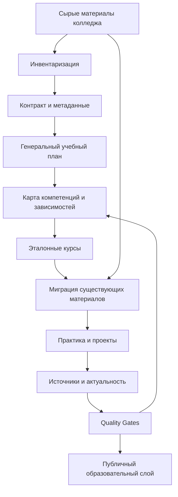

# План плановой реформации репозитория College

> Рабочий регламент для агентского ИИ и владельца проекта.
>
> Версия 1.0, 07.10.2026.
>
> Главная идея: **реформировать репозиторий не одним большим запуском, а серией маленьких управляемых сессий с фиксированным результатом, проверками и возможностью отката.**

---

# 1. Цель реформации

Не «переписать все Markdown-файлы», а постепенно перевести проект:

```text
склад материалов
       ↓
упорядоченное хранилище
       ↓
связанный учебный vault
       ↓
генеральная программа
       ↓
полноценные курсы
       ↓
проверяемая открытая образовательная система
```

При этом **поток новых материалов колледжа не останавливается**.

---

# 2. Основной принцип: два потока работы

Реформа должна идти параллельно с текущей жизнью колледжа.

## Поток A — оперативный

```text
Новая пара
 ↓
Сырой материал
 ↓
Первичная обработка
 ↓
Пометка статуса
```

Он не ждёт завершения реформы.

## Поток B — стратегический

```text
Аудит
 ↓
Архитектура
 ↓
Генеральный план
 ↓
Рефакторинг
 ↓
Курсы
 ↓
Связи
 ↓
Практика
 ↓
Контроль качества
```

Эти потоки не должны блокировать друг друга.

---

# 3. Главный запрет

> **Никогда не пытаться реформировать весь репозиторий за одну агентскую сессию.**

Причины:

- агент начинает держать слишком много контекста;
- увеличивается количество случайных изменений;
- повышается риск потери материала;
- сложнее проверить педагогические решения;
- трудно понять, какая правка вызвала проблему;
- растёт количество артефактов и противоречий.

Одна сессия = **одна ограниченная задача**.

---

# 4. Контракт каждой агентской сессии

Перед началом агент обязан прочитать минимум:

1. текущий `README.md`;
2. `00_Мета/00_Контекст.md` или актуальный аналог;
3. `00_Мета/Соглашения.md`;
4. `00_Мета/Реестр_дисциплин.md`;
5. текущий `00_Мета/Бэклог.md`;
6. конкретные файлы/папки, входящие в задачу;
7. предыдущий отчёт реформы, если он существует.

После чтения агент должен сформулировать для себя:

```text
Цель сессии:
Область изменений:
Что запрещено менять:
Критерии готовности:
Проверки после изменений:
```

Если агентская среда позволяет, эту фиксацию следует сохранить в отчёте сессии.

---

# 5. Правило «одной основной цели»

В одной сессии допускается:

- одна дисциплина;
- одна мета-задача;
- один шаблон;
- один слой инфраструктуры;
- один узкий участок генерального плана.

Примеры хороших задач:

- «Добавить модель статусов учебного материала».
- «Перестроить только реестр дисциплин».
- «Собрать авторский план 08. Компьютерные сети».
- «Рефакторить лекции 04 по новому контракту».
- «Проверить все источники курса 05».

Плохая задача:

> «Полностью привести в порядок весь репозиторий».

---

# 6. Этапы всей реформации

Реформа разбивается на последовательные этапы.

```text
R0 — Заморозка архитектурных предположений и инвентаризация
R1 — Метаданные и правила
R2 — Сырой контур колледжа
R3 — Генеральная программа и карта зависимостей
R4 — Эталонные курсы
R5 — Миграция существующих материалов
R6 — Практика и проекты
R7 — Источники и актуальность
R8 — Система контроля качества
R9 — Публичный образовательный слой
R10 — Непрерывное сопровождение
```

Один этап может занимать много отдельных сессий.

---

# 7. R0 — Инвентаризация

## Цель

Понять, что в репозитории существует на самом деле, прежде чем что-либо перестраивать.

## Работы

- полный список файлов;
- дисциплины;
- курсы;
- шаблоны;
- служебные документы;
- скрипты;
- изображения;
- диаграммы;
- архивы;
- состояние каждой заметки;
- внешние зависимости;
- текущие проверки.

## Результат

Создаётся:

```text
Реестр состояния репозитория
```

Агент не должен в этом этапе массово переписывать материал.

### Готово, когда

- найдено всё существенное;
- нет неизвестных крупных папок;
- понятны существующие правила;
- понятен запуск checker'а;
- сформирован список противоречий.

---

# 8. R1 — Метаданные и правила

## Цель

Создать единый язык для описания учебного контента.

Минимальный статус:

```text
raw
→ extracted
→ draft
→ reviewed
→ verified
→ ready
→ archived
```

Дополнительно:

```yaml
content_type: lecture|practice|course|project|reference|raw
origin: college|author|external|mixed
reviewed: 2026-10-07
```

Для технических материалов:

```yaml
technology:
  name: ...
  version: ...
```

Для источников:

```yaml
sources:
  - title: ...
    url: ...
    type: official|standard|book|course|article|video
    checked: ...
```

## Важное правило

Не менять существующий формат метаданных во всех заметках за один заход.

Сначала изменить контракт → проверить на 2–3 пилотных заметках → затем мигрировать небольшими пакетами.

---

# 9. R2 — Сырой контур колледжа

Это критически важная часть реформы.

Рекомендуемая логика:

```text
Материалы с пар
├── 2026-2027
│   ├── 01_Технология_разработки_ПО
│   ├── 02_Алгоритмизация
│   ├── ...
│   └── 24_Внедрение
└── Архив
```

В каждом сыром элементе желательно фиксировать:

```yaml
source_type: lecture|practice|assignment|presentation|personal_notes
college_subject: ...
teacher: ...
date: ...
owner_created: true|false
public_distribution: allowed|unknown|not_allowed
processed_into: ...
```

### Как сырьё превращается в учебный материал

```text
RAW
 ↓
Extract
 ↓
Compare with curriculum
 ↓
Verify
 ↓
Rewrite
 ↓
Practice
 ↓
Ready
```

Сырой файл не должен автоматически считаться качественным учебным материалом.

---

# 10. Авторское право в сыром контуре

Перед публикацией каждого неавторского файла агент должен задать вопрос:

> Есть ли право распространять этот файл в публичном GitHub-репозитории?

Если ответ неизвестен:

- файл не публиковать;
- зафиксировать библиографию;
- сохранить ссылку на источник;
- использовать только допустимую переработку/цитирование;
- пометить `public_distribution: unknown`.

Самый безопасный принцип для публичного репозитория:

> **Хранить собственные знания и ссылки, а не коллекционировать чужие PDF.**

---

# 11. R3 — Генеральная программа

Это самый важный архитектурный этап.

Сначала строится:

```text
Компетенции
 ↓
Учебные области
 ↓
Дисциплины
 ↓
Курсы
 ↓
Темы
 ↓
Prerequisites / Next topics
```

Только после этого массово переписываются лекции.

## Основной артефакт

`Генеральный учебный план 09.02.07.md`.

## Вторичные артефакты

- реестр компетенций;
- матрица «дисциплина → компетенция»;
- матрица «тема → prerequisites»;
- матрица «тема → практика»;
- матрица «тема → источник».

---

# 12. R4 — Эталонные курсы

Не реформировать сразу все 24 дисциплины.

Создать 3–4 эталона.

Рекомендуемые:

1. **04 Алгоритмизация и программирование** — главный образец базового курса.
2. **05 Проектирование БД** — образец технической дисциплины + проекта.
3. **08 Компьютерные сети** — образец фундаментальной системной дисциплины.
4. **15 Разработка ИС** — образец интеграционного курса.

Каждый эталон должен иметь:

- курс;
- карту зависимостей;
- лекции;
- практику;
- проект;
- источники;
- проверку кода/задач;
- quality gate.

После этого формат переносится на остальные дисциплины.

---

# 13. R5 — Миграция существующих материалов

Миграция выполняется партиями.

Пример:

```text
Сессия 1
Лекции 01–04

Сессия 2
Лекции 05–08

Сессия 3
Лекции 09–12

Сессия 4
Практика
```

Не смешивать одновременно:

- структурный рефакторинг;
- содержательное переписывание;
- добавление большого объёма новых тем;
- смену всех ссылок;
- смену имен файлов.

Если нужно сделать несколько изменений, агент должен разделить их на внутренние этапы и проверить каждый.

---

# 14. Правило миграции существующего текста

Перед заменой старой заметки:

1. сохранить исходную версию в Git;
2. понять, какие знания в ней есть;
3. выделить полезные факты;
4. выявить ошибки;
5. проверить источники;
6. перенести полезное;
7. добавить отсутствующее;
8. отметить изменения происхождения;
9. проверить ссылки;
10. запустить checker.

Нельзя:

> «Удалить старую лекцию и попросить AI написать новую с нуля»

без анализа покрытия исходного материала.

---

# 15. R6 — Практика и проекты

После формирования теории не надо бесконечно писать новые лекции.

Следующий цикл:

```text
Теория
 ↓
Упражнения
 ↓
Типовые задачи
 ↓
Новые задачи
 ↓
Проект
 ↓
Самопроверка
```

Практическая часть должна иметь отдельный аудит:

- задача выполнима;
- условие недвусмысленно;
- есть критерий успеха;
- окружение указано;
- пример запуска проверен;
- решение соответствует условию;
- сложность соответствует уровню курса.

---

# 16. R7 — Источники и актуальность

Для каждой дисциплины создать source register.

Минимальные поля:

```yaml
source_id:
title:
author:
type:
url:
license:
version:
last_checked:
used_for:
reliability:
notes:
```

## Правила

### Техническая документация

Первичный источник по поведению технологии.

### Стандарты / RFC

Первичный источник нормативного/протокольного утверждения.

### Университетский курс

Основа для педагогической структуры.

### Статья / видео

Дополнение.

### AI

Помощник, а не авторитет.

---

# 17. R8 — Контроль качества

Ввести семь quality gates.

## Gate 0 — Provenance

Откуда появился материал?

## Gate 1 — Structure

Корректно ли оформлена заметка?

## Gate 2 — Sources

Есть ли необходимые источники?

## Gate 3 — Factual correctness

Нет ли известных ошибок?

## Gate 4 — Pedagogy

Понятно ли, что и зачем учится?

## Gate 5 — Practice

Можно ли реально выполнить задание?

## Gate 6 — Integration

Связана ли тема с остальной программой?

## Gate 7 — Freshness

Не устарел ли материал?

---

# 18. Что обязательно проверять после каждой агентской сессии

Минимум:

```text
[ ] Git diff просмотрен
[ ] изменились только ожидаемые файлы
[ ] нет случайных удалений
[ ] ссылки проверены
[ ] metadata проверены
[ ] checker запущен
[ ] кодовые примеры запущены там, где это необходимо
[ ] новые источники доступны
[ ] статусы обновлены
[ ] бэклог обновлён
[ ] создан отчёт сессии
```

---

# 19. Отчёт каждой сессии

Рекомендуемый файл:

`00_Мета/Реформа/Сессии/YYYY-MM-DD_<краткое_название>.md`

Шаблон:

```markdown
# Отчёт сессии

## Цель

## Входные файлы

## Что изменено

## Что НЕ изменено

## Почему приняты такие решения

## Проверки

- checker:
- links:
- code:
- sources:

## Новые связи

## Открытые вопросы

## Следующий допустимый шаг

## Git commit
```

---

# 20. Git-правила для реформы

## Один содержательный этап — один понятный commit

Плохой commit:

```text
fix things
```

Хороший:

```text
reform(curriculum): add dependency model for databases
```

или:

```text
refactor(course-04): migrate Python block to lecture contract
```

## Ветви

Желательно:

```text
reform/R1-metadata
reform/R3-curriculum
reform/R4-course-05
reform/R6-practice
```

Если рабочая среда не использует ветви, всё равно сохранять маленькие логические commits.

---

# 21. Правило отката

Любая масштабная реформа должна быть обратимой.

Перед массовой миграцией:

```text
создать commit
 ↓
зафиксировать snapshot
 ↓
запустить реформу
 ↓
проверить
 ↓
сравнить diff
```

Если качество ухудшилось — откатывать конкретный этап, а не вручную чинить сотни строк.

---

# 22. Ограничения одной сессии для агента

Рекомендуемый бюджет:

- одна крупная концептуальная задача;
- одна дисциплина или один мета-модуль;
- небольшой понятный набор файлов;
- не более одного крупного изменения структуры папок за сессию;
- не объединять перенос файлов, смену схемы метаданных и переписывание содержания в один гигантский проход.

Если задача оказалась больше ожидаемого — агент должен остановить текущую цель на логической границе и записать остаток в бэклог/следующую сессию.

---

# 23. Приоритет очереди реформы

## Фаза A — фундамент

1. мета-контракт;
2. raw-слой;
3. генеральный учебный план;
4. competency map;
5. dependency map.

## Фаза B — три эталонных курса

6. алгоритмы/Python;
7. БД/SQL;
8. ОС/сети.

## Фаза C — инженерный слой

9. Git;
10. технология разработки;
11. инструментальные средства;
12. моделирование;
13. проектирование;
14. разработка;
15. тестирование.

## Фаза D — жизненный цикл ИС

16. внедрение;
17. сопровождение;
18. техническая поддержка;
19. стандартизация;
20. сертификация.

## Фаза E — математика и расширение

21. высшая математика;
22. дискретка;
23. численные методы;
24. математическое моделирование;
25. интеллектуальные системы.

---

# 24. Правило для новых материалов из колледжа во время реформы

Когда появляется новая лекция:

```text
Не ждать реформу
↓
Принять RAW
↓
Зарегистрировать
↓
Не считать её канонической
↓
Позже интегрировать в соответствующий курс
```

Это позволит продолжать учёбу, не разрушая стратегическую реформу.

---

# 25. Если материал колледжа противоречит авторской программе

Не удалять.

Создать связь:

```text
Материал колледжа
      ↓
Фактический вариант
      ↓
Проверка
      ↓
Авторское объяснение
      ↓
Почему используется другая модель
```

Например:

> «На занятии использовалась упрощённая модель X. В современной технической документации/академическом курсе используется Y. Для экзамена может понадобиться X; для профессиональной практики — Y.»

Это особенно важно для старых учебников и терминов.

---

# 26. Работа с устаревшими технологиями

Если материал исторически важен для колледжа, не удалять автоматически.

Разделять:

```text
Учебно-исторический материал
vs
Современная практика
```

Например:

```text
MS Access
→ исторический учебный опыт

SQL + PostgreSQL
→ современная основа курса БД
```

Старое не всегда бесполезно, но старое не должно незаметно становиться рекомендацией на 2026+ годы.

---

# 27. Правило версий технологий

Нельзя писать:

> «Django поддерживает ...»

если поведение зависит от версии и версия не указана.

Предпочтительно:

```text
Проверено на Django X.Y
Проверено на Python X.Y
Проверено на PostgreSQL X
```

Для концептуального утверждения версия может быть не нужна, но для API, команд, конфигураций и кода — обычно нужна.

---

# 28. Правило проверки кода

Пример кода считается проверенным только если:

- он запускается;
- окружение известно;
- зависимости зафиксированы или понятны;
- результат соответствует описанию;
- исключения/ошибки разбираются, если они являются частью примера.

Для критически важных примеров желательно хранить минимальный воспроизводимый проект.

---

# 29. Правило проверки ссылок

После структурных изменений обязательно:

- проверить внутренние wiki-ссылки;
- проверить относительные ссылки;
- проверить внешние URL там, где это возможно;
- не допускать ссылок на удалённые/неактуальные документы без пометки;
- не оставлять неоднозначные ссылки на одинаково названные заметки.

---

# 30. Правило изменения шаблонов

Шаблон — инфраструктура.

Изменение шаблона не равно изменение одной лекции.

Поэтому:

```text
Шаблон
 ↓
2–3 пилота
 ↓
проверка
 ↓
утверждение
 ↓
пакетная миграция
```

Не менять шаблон одновременно с массовой реформой десяти дисциплин.

---

# 31. Правило агентского ИИ: сначала анализ, потом изменения

Каждая крупная сессия должна иметь две внутренние фазы:

### Phase A — analyse

Агент:

- читает материалы;
- строит карту текущего состояния;
- перечисляет противоречия;
- предлагает изменения.

### Phase B — edit

Только после этого вносятся изменения.

Это резко уменьшает случайный рефакторинг.

---

# 32. Агенту запрещено «улучшать заодно»

Если задача:

> «Мигрировать лекции курса 05 на новый формат»

агент не должен заодно:

- переписать философию проекта;
- переименовать весь каталог;
- изменить генеральный план;
- поменять систему статусов;
- удалить старые курсы;
- обновить README по собственному желанию.

Все такие изменения — отдельные задачи.

---

# 33. Правило открытых вопросов

Если агент встречает неопределённость, он не должен скрывать её генерацией уверенного текста.

Вместо этого:

```text
OPEN QUESTION

Что известно:
...

Что неизвестно:
...

Какие варианты:
A
B
C

Что требуется проверить:
...
```

Это особенно важно для:

- границ дисциплин;
- неизвестных тем колледжа;
- нормативных требований;
- версии технологий;
- происхождения материала.

---

# 34. Реестр качества дисциплины

Для каждой дисциплины в конечной системе желательно считать:

```text
coverage
source_coverage
practice_coverage
dependency_coverage
freshness
verification
project_coverage
```

Например:

```yaml
coverage: 72
source_coverage: 81
practice_coverage: 60
dependency_coverage: 90
freshness: 85
verification: 70
project_coverage: 50
```

Именно эти показатели полезнее, чем количество слов.

---

# 35. Чего не следует делать до появления архитектуры

Не надо прямо сейчас:

- переписывать все 24 дисциплины;
- создавать сотни новых лекций;
- создавать отдельный курс для каждого инструмента;
- превращать каждую тему в огромный текст;
- делать сложный сайт поверх базы;
- оптимизировать Obsidian-плагины вместо образовательной архитектуры;
- массово добавлять диаграммы;
- массово внедрять AI-generated quizzes без проверки.

Сначала качество модели, потом масштаб.

---

# 36. Как агент должен завершать сессию

Последняя часть ответа/отчёта агента должна содержать:

```text
SESSION RESULT

1. Выполнено:
...

2. Не выполнено:
...

3. Изменённые файлы:
...

4. Проверки:
...

5. Новые открытые вопросы:
...

6. Следующий безопасный шаг:
...

7. Commit:
...
```

Запрещено заканчивать:

> «Я улучшил репозиторий и всё готово»

без конкретного перечисления изменений и проверок.

---

# 37. Критерий перехода между этапами реформы

Переходить далее можно только если текущий слой стабилен.

Например:

```text
Нельзя массово мигрировать лекции,
если ещё меняется сам шаблон лекции.
```

```text
Нельзя строить карту компетенций поверх хаотических дисциплин,
если ещё неизвестен список дисциплин.
```

```text
Нельзя объявлять курс завершённым,
если нет практической проверки.
```

---

# 38. Итоговая схема реформации



---

# 39. Минимальная структура реформационной служебной зоны

Рекомендуемая будущая структура:

```text
00_Мета/
├── 00_Контекст.md
├── Соглашения.md
├── Генеральный_учебный_план.md
├── Реестр_дисциплин.md
├── Реестр_компетенций.md
├── Карта_зависимостей.md
├── Реестр_источников.md
├── Бэклог.md
├── Доска_задач.md
├── Аудиты/
├── Реформа/
│   ├── План_реформации.md
│   └── Сессии/
├── Сырые_материалы/
└── Скрипты/
```

Это предложение не означает необходимость создать всё одним commit.

---

# 40. Главный закон реформы

> **Каждая сессия должна сделать систему немного более связной, проверяемой и понятной, не разрушая уже накопленные знания.**

Не существует требования «успеть всё».

Есть последовательность:

```text
пойми
→ зафиксируй
→ проверь
→ измени небольшую часть
→ протестируй
→ зафиксируй результат
→ переходи дальше
```

---

# 41. Первые рекомендуемые сессии

## Сессия R0.1

**Инвентаризация репозитория.**

Ничего массово не менять.

Результат: снимок состояния.

## Сессия R0.2

**Аудит текущих правил.**

Найти противоречия между:

- `Контекст`;
- `Соглашения`;
- `Реестр`;
- `README`;
- фактической структурой.

## Сессия R1.1

**Утвердить модель статусов и происхождения материала.**

## Сессия R2.1

**Создать raw-поток материалов колледжа.**

## Сессия R3.1

**Перенести генеральный учебный план в мета-слой.**

## Сессия R3.2

**Создать карту зависимостей дисциплин.**

## Сессия R4.1

**Аудит курса 04.**

Не переписывать его вслепую — сначала сравнить с новым генеральным планом.

## Сессия R4.2

**Собрать авторскую программу курса 05.**

## Сессия R4.3

**Собрать авторскую программу курса 08.**

## Сессия R4.4

**Собрать авторскую программу курса 01.**

После стабилизации этих четырёх курсов начинать более массовую миграцию.

---

# 42. Долгосрочная модель жизни проекта

После завершения основной реформы проект не должен вернуться к хаосу.

Постоянный цикл:

```text
Новый материал
 ↓
RAW
 ↓
Curriculum mapping
 ↓
Source verification
 ↓
Draft
 ↓
Practice
 ↓
Review
 ↓
Ready
 ↓
Periodic freshness review
```

То есть реформа заканчивается, но **система сопровождения остаётся**.

---

# 43. Финальная цель

Идеальное состояние репозитория:

```text
                 Профессиональная компетенция
                              ↑
                     Учебная траектория
                              ↑
          ┌───────────────────┴──────────────────┐
          │                                      │
      Дисциплины                              Курсы
          │                                      │
          └──────────────┬───────────────────────┘
                         ↓
                     Концепты
                         ↓
                    Практика
                         ↓
                      Проекты
                         ↓
                Проверяемый результат
                         ↑
                    Источники
                         ↑
                  Контроль качества
                         ↑
                  Дата актуальности
```

И отдельно, рядом с этим публичным знанием:

```text
Сырые материалы колледжа
```

которые постоянно поступают в систему, но **не смешиваются с проверенным авторским учебным содержанием**.

---

# 44. Принцип лично для владельца проекта

Ты не обязан физически переписать весь репозиторий сам.

Твоя главная роль должна постепенно перейти от:

> «человек, который вручную пишет все конспекты»

к:

> **«владелец образовательной системы, который определяет цели, проверяет решения, задаёт стандарты качества и учится вместе с построением системы».**

Агент может писать, переносить, искать противоречия, строить таблицы, проверять ссылки и помогать с источниками.

Но именно владелец должен принимать ключевые решения:

- чему учим;
- зачем этому учим;
- что считаем достаточным уровнем;
- какой источник считаем надёжным;
- где проходит граница курса;
- когда материал действительно готов.

Именно это позволит одновременно использовать агентский ИИ и не превратить проект в безконтрольный генератор текста.
