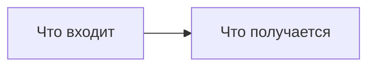

# <% tp.file.title %>

> [!abstract] О чём эта лекция
>
> **Зачем это нужно.**
>
> **Что ты должен уметь после лекции:**
>
> *Пояснение для начинающих (для чайника):* одна аналогия, которая снимает страх перед темой.

---

# Разделы темы

_Только то, что реально было на паре. В каждом разделе: термин → пример → «как ошибаются»._

_Минимум 1–2 диаграммы на лекцию (правило Р6): `flowchart` для процесса, `gitGraph` для веток,
`sequenceDiagram` для взаимодействий, `xychart-beta` для роста. Без `style fill`._

---

# Ключевые термины

| Термин | Определение |
|---|---|
|  |  |

---

# Типичные заблуждения

- ❌ **«Миф».** Опровержение.

---

# Связи с другими темами

- [[]] — зачем идти.

<!--
Чек-лист перед `status: готово` (Соглашения §2, §6, §8):
  [ ] заголовок H1 = имя файла без номера
  [ ] есть «Ключевые термины», «Типичные заблуждения», «Связи с другими темами»
  [ ] 1–2 Mermaid-диаграммы, пояснение «для чайника» в abstract
  [ ] каждая конструкция в примере объяснена или помечена «(продвинутое)»
  [ ] незнакомый API объяснён на месте
  [ ] блок-якоря с понятными именами: ^kak-eto-rabotaet, а не ^a1b2c3
  [ ] python3 00_Мета/проверка_базы.py и python3 00_Мета/линк_чекер.py — 0 проблем
-->
