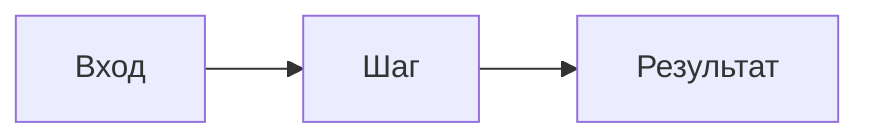

# <% tp.file.title %>

> [!abstract] Что за работа
>
> **Теория:** _(укажи ссылку на лекцию в поле `related_lecture` выше)_
>
> **Что даёт результат:**

---

# Ход работы

_Если работа из задач — каждая как `## Задача N. Название`; условие и ответ разделены._

---

# Вывод

_Что получилось, что осталось непонятным, что проверить в следующий раз._

---

# Связи с другими темами

-

<!--
Чек-лист перед status: готово (Соглашения 3, 6, 8):
  [ ] заполнены related_lecture, «Ход работы», «Вывод», «Связи с другими темами»
  [ ] ответ оформлен как ответ, а не как черновик
  [ ] незнакомый API объяснён на месте или помечен «(продвинутое)»
  [ ] python3 00_Мета/проверка_базы.py и python3 00_Мета/линк_чекер.py — 0 проблем
-->
